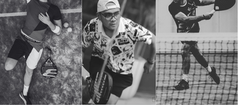

   
<!DOCTYPE html>
<html lang="en">
<head>
  <meta charset="UTF-8" />
  <meta name="viewport" content="width=device-width, initial-scale=1" />
  <title>Padel Party Reservation</title>
  
</head>
<body>
  

    <header>
      

      
SALY's

    </header>

    <h1 class="main-title" aria-label="Padel Party Title">PADEL PARTY</h1>

    <section class="event-details" aria-label="Event Details">
      
<em>NOVEMBER 8, 2 PM</em>

      
HOUSE OF PADEL, AGORA MALL JAKARTA PUSAT

    </section>

    <section class="images-row" aria-label="Padel images">
      
    </section>

    <section class="rsvp-section" aria-label="RSVP Section">
      

        

          <h2>RSVP</h2>
        

      
      

      <form id="rsvpForm">
        

          

            <label for="name" class="rsvp-form-label">Name :</label>
            <input type="text" id="name" name="name" autocomplete="name" required />
            <label for="phone" class="rsvp-form-label">HP Number :</label>
            <input type="tel" id="phone" name="phone" autocomplete="tel" required />
          

          

            <label class="rsvp-form-label" style="margin-bottom:4px;">Join Party :</label>
            

              <input type="radio" id="yes" name="join" value="yes" />
              <input type="radio" id="no" name="join" value="no" checked />
              <label for="yes" class="toggle-label">YES</label>
              <label for="no" class="toggle-label">NO</label>
              
            

            <button type="submit" class="btn-submit">Submit</button>
          

        

      </form>
  
    </section>
    <!-- Download CSV button removed, now using Google Sheets integration -->
  

  <footer></footer>
  
</body>
</html>
